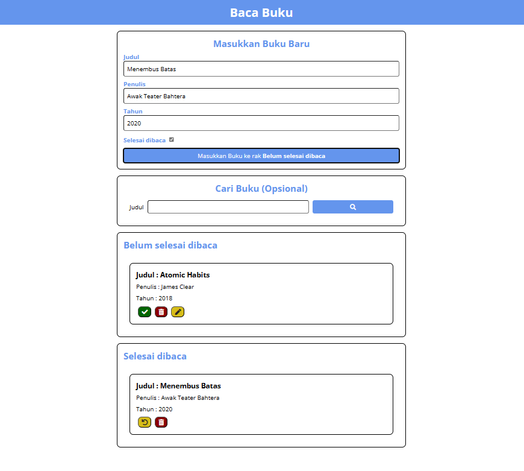

# Baca Buku

Simple web app for documenting books that have been read and unread.

## Demo

Demo Live : [Baca Buku](https://fazrilarief.github.io/baca-buku/)

## Features

1. **Add Book**: Add books to the list by filling out a form that includes the title, author, and reading status (read or to be read).
2. **View Book List**: View the list of books you have added, including information such as title, author, and reading status.
3. **Remove Book**: Remove a book from the list if it has been read or if you want to delete it.
4. **Local Storage**: Utilizes Web Storage to temporarily store book data on the user's device.

## Getting Started

To get started with Kerjain.com, follow these steps:

1. Clone the repository: `https://fazrilarief.github.io/baca-buku/`
2. Install dependencies: `npm install`
3. Start the development server: `npm start`

## Contributing

We welcome contributions! If you have ideas for improvement or encounter issues, please submit a pull request or open an issue.

